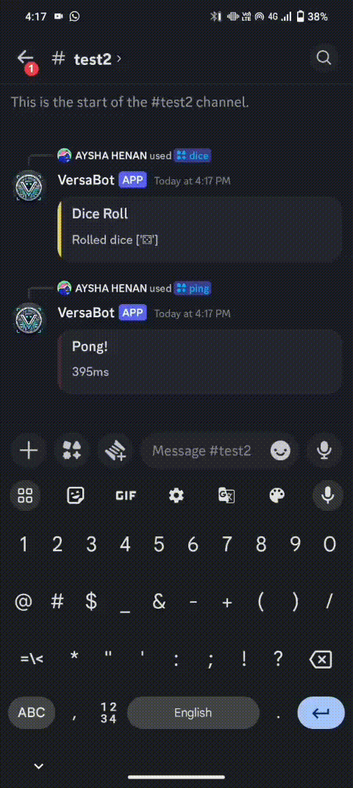
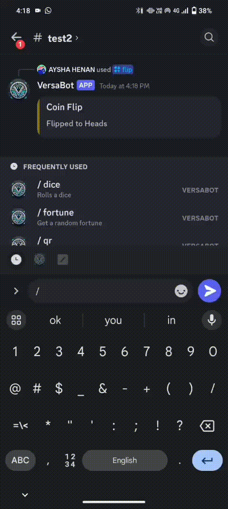
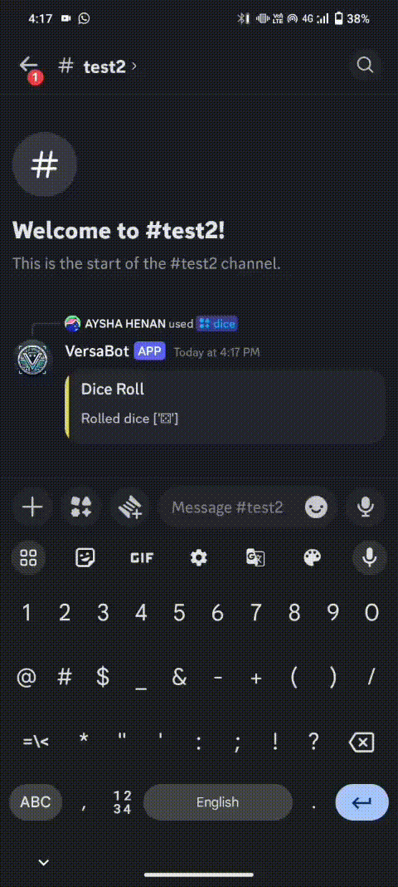
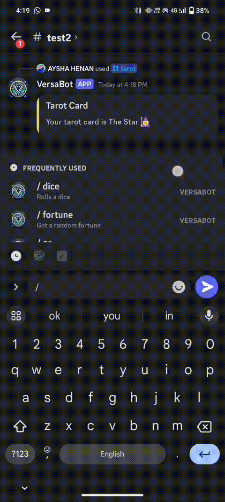
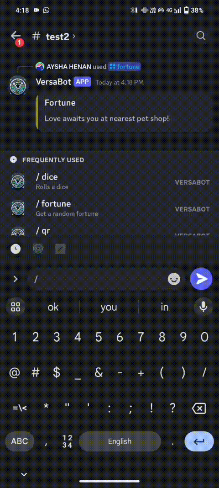
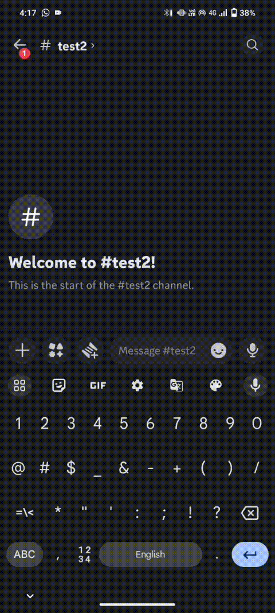

<div align="center">

# 🎯 VersaBot
### Your All-in-One Discord Companion


[](https://github.com/Scemworks/VersaBot)

</div>

## 🌟 Project Overview

### 🚀 Created by TechnoMinds

### Team Members 👥

| Role | Name | Institution |
|------|------|-------------|
| **Team Lead** | Mohammed Shadin | Government Engineering College, Sreekrishnapuram |
| **Member** | Aysha Henan | Government Engineering College, Sreekrishnapuram |
| **Member** | Mohammed Ameen | Government Engineering College, Sreekrishnapuram |

### Project Description 🤖

VersaBot is your all-in-one Discord companion that brings fun and utility to your server! With an easy-to-use command system, it offers:

✨ **Fun Commands:**
- Roll dice for games and decisions
- Flip coins to settle debates
- Generate QR codes instantly  
- Get mystical fortune readings

Perfect for making your Discord server more engaging and entertaining! Just use simple commands and let VersaBot handle the rest.

### Why VersaBot? 🤔

Discord servers can sometimes feel a bit quiet and routine. That's where VersaBot comes in! It's your friendly companion that:

- Makes conversations more engaging and fun
- Adds an element of chance and excitement with games
- Brings a touch of magic with fortune telling
- Helps make decisions in a fun way
- Keeps your server members entertained and connected

### The Solution 🎮
VersaBot brings fun and utility to your Discord server:

- 🎲 Roll dice for games and decisions
- 🪙 Flip coins to settle debates 
- 📱 Generate QR codes instantly
- 🔮 Get mystical fortune readings
- ⚡ Fast response times
- 🤖 Easy to set up and use

Your server's new best friend for entertainment and useful tools!

## Technical Details 🛠️

### Core Technologies
- 🐍 **Python** - Main programming language
- 🤖 **Discord-py-interactions** - Discord bot framework
- 🔐 **dotenv** - Environment variable management

### Additional Libraries
- 📱 **qrcode** - QR code generation
- 🖼️ **PIL (Pillow)** - Image processing
- 🌐 **aiohttp** - Asynchronous HTTP requests


### Implementation
For Software:

# Clone Repository
```bash
git clone https://github.com/Scemworks/VersaBot.git
```
# Navigate to the project directory
```bash
cd VersaBot
```
# Installation
```bash
pip install -r requirements.txt
```
# Run
```bash
python main.py
```
# Note
* Add your bot token in the .env file before running the bot.
```plaintext
TOKEN="your_bot_token"
```

### Additional Resources
For more details about VersaBot, including its commands and setup instructions, visit the official site: [VersaBot Documentation](https://versabot-tau.vercel.app/)

### Project Documentation
For Software:

# Video Demonstration
[Watch the video showcasing VersaBot in action!](https://youtu.be/arMEIf3-GDo)

# Screenshots

Here are some examples of VersaBot's commands in action:

## Flip Command

> Flip a virtual coin to make decisions

## Fortune Command  

> Get your fortune read with mystical predictions

## Ping Command

> Check the bot's response time

## QR Code Generator

> Generate QR codes from text or URLs

## Tarot Reading

> Draw virtual tarot cards for spiritual guidance

## Dice Roll

> Roll virtual dice for games or decisions


## Team Contributions 🤝

| Team Member | Contributions |
|------------|---------------|
| Mohammed Shadin | • Main bot architecture and core functionality<br>• Command implementation and integration<br>• Project coordination |
| Aysha Henan | • Fortune command development<br>• Productivity Parrot command implementation |
| Mohammed Ameen | • Tarot reading command development |

---
Made with ❤️ at TinkerHub Useless Projects 


